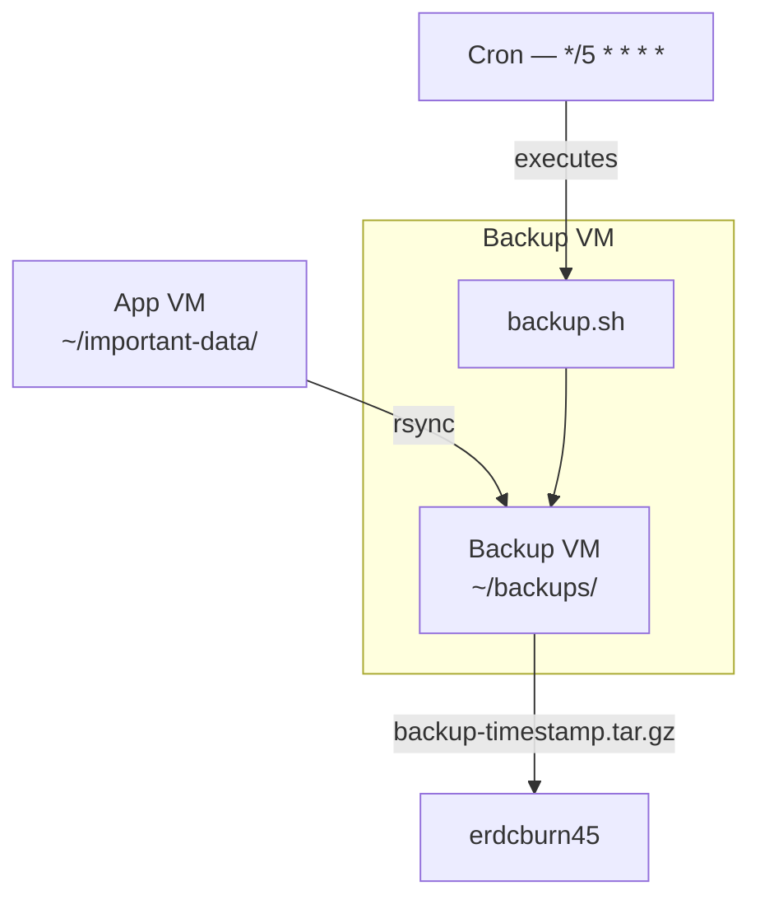

# Backup mechanism

```mermaid
flowchart TD
    cron["Cron — */5 * * * *"]
    script["backup.sh"]
    appvm["App VM\n~/important-data/"]
    backupvm["Backup VM\n~/backups/"]
    swift["erdcburn45"]

    cron -->|executes| script
    subgraph backupvm_box["Backup VM"]
        script
        backupvm
    end
    appvm -->|rsync| backupvm
    backupvm -->|backup-timestamp.tar.gz| swift
    script --> backupvm
```
